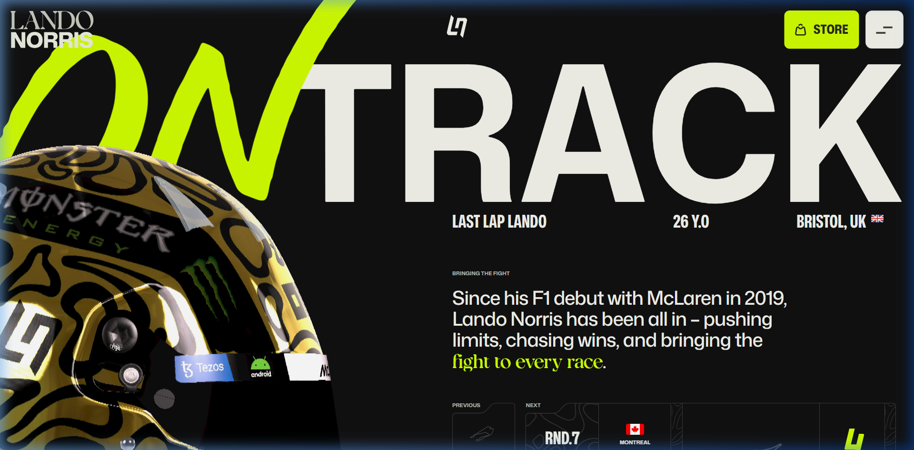
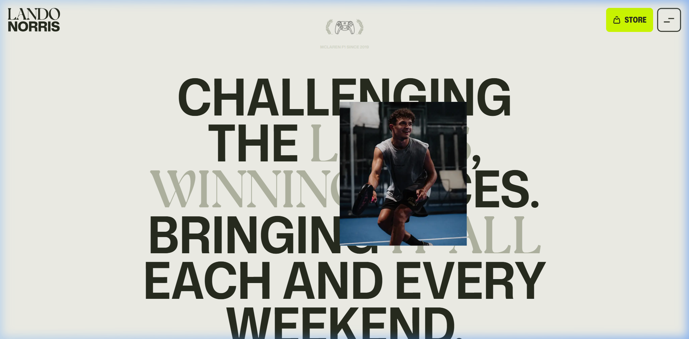
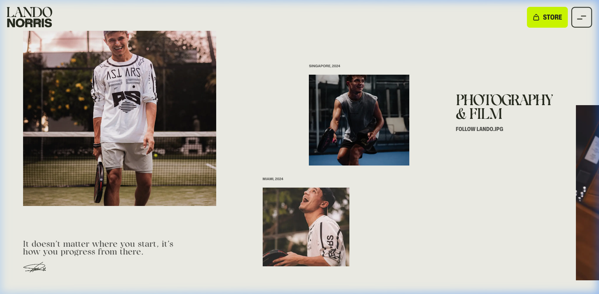
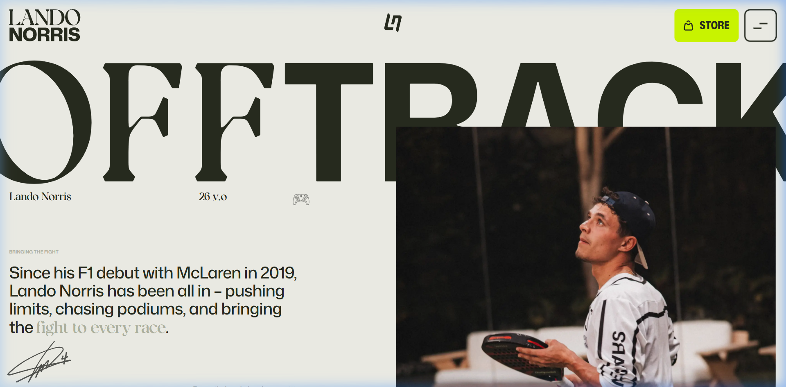

# 레전드 페이지 기획 (`/legends`)

> **디자인 참조: landonorris.com 전반의 에디토리얼 레이아웃 테크닉**
> 거대 타이포, 비대칭 배치, 사진-텍스트 레이어 겹침 등의 기법을 차용하되
> YBBF 보디빌딩 협회 브랜드에 맞는 다크/시네마틱 톤으로 재해석한다.

---

## 컨셉

대회 입상자들을 **"레전드"**로 네이밍한다.
이들의 이력, 역사, 미디어를 집중 노출하여
**협회의 자랑이자 얼굴**로 만든다.

---

## 레퍼런스에서 추출한 디자인 테크닉

> 아래는 참조 사이트에서 뽑아낸 **기법**이다. 그대로 베끼는 것이 아니라
> 보디빌딩 선수 프로필이라는 맥락에 맞게 변환 적용한다.

### 테크닉 A: 거대 타이포 + 오브제 겹침

- 뷰포트를 가득 채우는 거대 타이포그래피
- 오브제(인물/장비 등)가 텍스트 **위에** 겹쳐서 레이어 깊이감 형성
- 일부 글자는 네온 컬러, 나머지는 화이트 → 시각 리듬
- **YBBF 적용**: 선수 컷아웃 이미지가 선수명 타이포 위에 겹침

### 테크닉 B: 에디토리얼 텍스트 + 사진 관통

- 화면 전체를 차지하는 여러 줄의 거대 텍스트
- 중앙에 사진이 텍스트를 관통하며 일부를 가림 → 고급 잡지 느낌
- 단어별로 굵기/투명도 차이를 줘서 리듬감 생성
- **YBBF 적용**: 선수 소개문이나 인용구를 이 방식으로 표현

### 테크닉 C: 비대칭 산발 이미지 배치

- 정형 그리드 없이 이미지가 **자유롭게 흩뿌려진** 레이아웃
- 각 이미지 위에 작은 장소/연도 라벨
- 큰 이미지 1개 + 작은 이미지 2~3개의 비대칭 조합
- 하단에 필기체 인용문 + 서명
- **YBBF 적용**: 갤러리를 대회명/연도 라벨과 함께 산발 배치

### 테크닉 D: 히어로 비대칭 레이아웃

- 좌측에 텍스트(타이포 + 소개 + 메타데이터), 우측에 대형 이미지
- 둘이 겹치지만 각자 명확한 영역을 가짐
- 메타데이터(이름, 나이 등)가 가로로 분산 배치
- **YBBF 적용**: 선수 프로필 정보와 대회 사진의 비대칭 공존

---

## 페이지 A: 레전드 전체 목록 (`/legends`)

### 섹션 1: 히어로 (풀스크린)
- 거대 타이포 **"LEGENDS"** — 뷰포트 50%+ 크기, stroke/outline 스타일
- 배경: 대회 하이라이트 사진 (흑백 or 고대비 그레이딩)
- 메타데이터: `"SINCE 1990"` `"XX CHAMPIONS"` 등 작은 라벨
- 스크롤 시 타이포가 위로 패럴랙스하며 콘텐츠 등장

### 섹션 2: 핵심 수치 (Giant Stats)
- 뷰포트 절반을 차지하는 거대 숫자
- 레이아웃: 가로 3분할 또는 스태거드 배치
```
  47              12              35
  TOTAL           WEIGHT          YEARS OF
  CHAMPIONS       CLASSES         LEGACY
```
- 숫자: stroke outline 스타일 + 카운트업 애니메이션
- 네온 라임 핸드라이팅 폰트로 `"챔피언"` 같은 주석 오버레이

### 섹션 3: 레전드 로스터 (선수 그리드)
- **필터**: 체급별 / 연도별 탭 (상단 고정)
- 카드 디자인:
  - 흑백 선수 사진 (호버 시 컬러 전환 + 스케일업)
  - 이름: 거대 볼드 타이포
  - 체급 + 수상연도 메타데이터
  - 호버 시 주요 전적 오버레이 등장
- 그리드: 3~4컬럼, 비대칭 높이 (메이슨리 느낌)
- 클릭 시 → `/legends/:id` 상세 페이지 이동

---

## 페이지 B: 레전드 상세 (`/legends/:id`)

### 섹션 1: 히어로 (선수 프로필)
- `LegendWebGLHero` 컴포넌트 사용 (원본 `WebGLHero.tsx` 복사본, 독립 관리)
  - 다크 테마 고정 + 골드/웜 파동 + 루마키 마스크 (누끼 없는 사진도 배경 자동 제거)
- 선수 컷아웃 이미지가 거대 타이포(선수명) **위에 겹쳐** 레이어 깊이감 형성 (테크닉 A)
- 이름: 거대 타이포 (`KIM MINSU` 스타일, 성은 accent 컬러)
- 메타데이터 배치: 체급, 키, 몸무게, 소속 클럽 (방송사 스타일 하단 배치)
- 스크롤 시 스탯이 순차적으로 등장하는 애니메이션

### 섹션 2: 에디토리얼 인트로 (테크닉 B 적용)
- 선수의 소개 또는 인용문을 풀폭 거대 텍스트로 표현
- 일부 키워드는 `accent` 컬러로 강조, 나머지는 `muted`로 리듬
- 대회 사진 1장이 텍스트 중앙을 관통하며 겹침
- 보디빌딩 맥락 예시:
  ```
  한계를 부수고
  [무대] 위에서         ← accent 강조
  증명하는 자.          ← 사진이 이 줄을 관통
  그것이 [챔피언]이다.
  ```

### 섹션 3: 전적 테이블
- 풀폭 다크 테이블
- 컬럼: `연도` | `대회명` | `체급` | `순위`
- 1위: 🏆 아이콘 + 네온 라임 하이라이트 행
- 볼드 타이포, 넉넉한 행 높이 (60px+)
- 행간 구분: 미세한 `border-divider` 라인

### 섹션 4: 갤러리 (테크닉 C 적용)
- ❌ 정형 그리드 금지
- ✅ 비대칭 산발 배치: 큰 이미지 1 + 작은 이미지 2~3
- 각 이미지 위에 대회명/연도 라벨 (`용인시장배, 2024`)
- 흑백 기본 → 호버 시 컬러 전환
- 하단에 선수 인용문 (이탤릭)
- 클릭 시 라이트박스 모달

### 섹션 5: 관련 미디어
- 인터뷰/하이라이트 영상 카드 (2~3개)
- 썸네일 + 제목 + 재생 시간

---

## 데이터 모델

```typescript
interface Legend {
  id: string;
  name: string;           // 김민수
  nameEn: string;         // KIM MINSU
  nickname?: string;      // "THE MACHINE"
  profileImage: string;   // 컷아웃 이미지 경로
  class: string;          // 클래식 피지크
  height: number;         // 182
  weight: number;         // 95
  club?: string;          // 소속 체육관
  bio?: string;           // 선수 소개글 (에디토리얼 섹션용)
  quote?: string;         // 선수 인용문
  titles: Title[];        // 수상 이력
  gallery: string[];      // 대회 사진 경로 배열
  mediaIds?: string[];    // 관련 미디어 ID
}

interface Title {
  year: number;
  competition: string;    // 용인시장배
  result: string;         // Overall 우승
  class: string;          // 출전 체급
}
```

---

## 메인페이지 연결

- 기존 `HallOfFame` → **"LEGEND COLLECTION"** 리브랜딩
- 최근 3~5명의 레전드를 시네마틱 카드로 표시
- `[전체 레전드 보기 →]` CTA 버튼 → `/legends`
- 기존 `StageSections ON STAGE` → **"LEGENDS HIGHLIGHT"** 프리뷰

---

## 구현 규칙

1. `WebGLHero.tsx`는 절대 수정하지 않는다. `LegendWebGLHero.tsx`를 별도 관리.
2. 루마키(Luma Key) 마스크가 셰이더 내에 포함 — 누끼 없는 사진도 검정 배경 자동 제거.
3. 서브페이지 Nav는 `isDarkTheme = true` 강제 적용.
4. SPA `<Link>` 대신 `<a href>` 사용 (GSAP DOM 조작으로 인한 React 충돌 방지).
